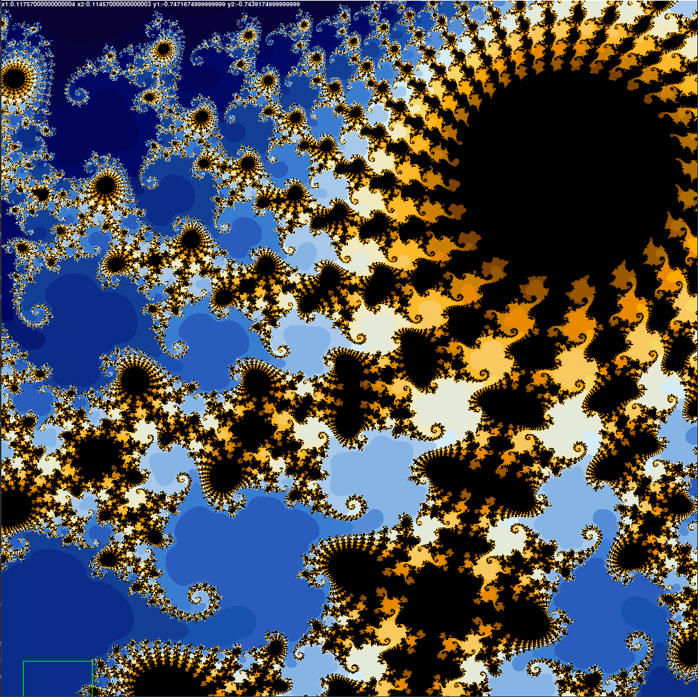

# python-complex-Fractals
a few python tools for learning about creating fractals and working with complex numbers.
made for education.
in development. please note that if a script could be very easily optimised i do know i just am either working on it or will leave it simple for educational purposes

### Created using Wikipedia pseudocode:

_native: basic no libraries, makes the array. configurable size and iterations_
```
[1, 1, 1, 1, 1, 1, 1, 1, 1, 1, 1, 1, 1, 1, 1, 1, 1, 1, 1, 1, 1, 1, 1, 1, 1, 1, 1, 1, 1, 1]
[1, 1, 1, 1, 1, 1, 1, 1, 1, 1, 1, 1, 1, 1, 1, 1, 1, 1, 1, 1, 1, 1, 1, 1, 1, 1, 1, 1, 1, 1]
[1, 1, 1, 1, 1, 1, 1, 1, 1, 1, 1, 1, 1, 1, 1, 1, 1, 1, 1, 1, 1, 1, 1, 1, 1, 1, 1, 1, 1, 1]
[1, 1, 1, 1, 1, 1, 1, 1, 1, 1, 1, 1, 1, 1, 1, 1, 1, 1, 1, 1, 1, 1, 1, 1, 1, 1, 1, 1, 1, 1]
[1, 1, 1, 1, 1, 1, 1, 1, 1, 1, 1, 1, 1, 1, 1, 1, 1, 1, 1, 1, 1, 1, 1, 1, 1, 1, 1, 1, 1, 1]
[1, 1, 1, 1, 1, 1, 1, 2, 2, 3, 3, 3, 4, 4, 5,99, 5, 4, 4, 3, 3, 3, 2, 2, 1, 1, 1, 1, 1, 1]
[1, 1, 2, 2, 2, 3, 3, 3, 3, 3, 3, 4, 4, 4, 5,99, 5, 4, 4, 4, 3, 3, 3, 3, 3, 3, 2, 2, 2, 1]
[2, 2, 2, 3, 3, 3, 3, 3, 3, 3, 4, 4, 4, 5, 6,99, 6, 5, 4, 4, 4, 3, 3, 3, 3, 3, 3, 3, 2, 2]
[2, 3, 3, 3, 3, 3, 3, 3, 3, 4, 4, 5, 5, 6, 7,99, 7, 6, 5, 5, 4, 4, 3, 3, 3, 3, 3, 3, 3, 3]
[3, 3, 3, 3, 3, 3, 3, 3, 3, 4, 5, 5, 5, 8, 9,99, 9, 8, 5, 5, 5, 4, 3, 3, 3, 3, 3, 3, 3, 3]
[3, 3, 3, 3, 3, 3, 3, 3, 4, 6, 6, 7, 7, 9,27,99,27, 9, 7, 7, 6, 6, 4, 3, 3, 3, 3, 3, 3, 3]
[3, 3, 3, 3, 3, 3, 3, 4, 6, 8,11,11,14,99,99,99,99,99,14,11,11, 8, 6, 4, 3, 3, 3, 3, 3, 3]
[3, 3, 3, 3, 3, 3, 4, 5, 5, 7, 9,19,99,99,99,99,99,99,99,19, 9, 7, 5, 5, 4, 3, 3, 3, 3, 3]
[3, 3, 3, 3, 4, 4, 5, 5, 5, 7,10,98,99,99,99,99,99,99,99,98,10, 7, 5, 5, 5, 4, 4, 3, 3, 3]
[3, 3, 3, 4, 4, 4, 5, 5, 6, 7, 8,38,99,99,99,99,99,99,99,38, 8, 7, 6, 5, 5, 4, 4, 4, 3, 3]
[3, 4, 4, 4, 4, 5, 6, 6, 7, 8 10,12,16,25,48,99,48,25,16,12,10, 8, 7, 6, 6, 5, 4, 4, 4, 4]
[4, 4, 4, 4, 5, 8, 8, 9,19,34,99,99,99,99,99,99,99,99,99,99,99,34,19, 9, 8, 8, 5, 4, 4, 4]
[4, 4, 4, 5, 6,14,99,99,99,99,99,99,99,99,99,99,99,99,99,99,99,99,99,99,99,14, 6, 5, 4, 4]
[4, 5, 5, 6, 7,12,26,99,99,99,99,99,99,99,99,99,99,99,99,99,99,99,99,99,26,12, 7, 6, 5, 5]
[5, 6, 8, 9,10,15,99,99,99,99,99,99,99,99,99,99,99,99,99,99,99,99,99,99,99,15,10, 9, 8, 6]
[9, 9,15,99,99,99,99,99,99,99,99,99,99,99,99,99,99,99,99,99,99,99,99,99,99,99,99,99,15, 9]
[11, 9,12,99,99,23,99,99,99,99,99,99,99,99,99,99,99,99,99,99,99,99,99,99,99,23,99,99,12,9]
[4, 5, 6, 7, 8,54,99,99,99,99,99,99,99,99,99,99,99,99,99,99,99,99,99,99,99,54, 8, 7, 6, 5]
[4, 4, 5, 5, 6, 8,42,99,99,99,99,99,99,99,99,99,99,99,99,99,99,99,99,99,42, 8, 6, 5, 5, 4]
[3, 4, 4, 5, 6, 7,15,99,21,99,99,99,99,99,99,12,99,99,99,99,99,99,21,99,15, 7, 6, 5, 4, 4]
[3, 3, 3, 4, 4, 6, 9, 6, 7, 9,62,10,22, 9, 6, 6, 6, 9,22,10,62, 9, 7, 6, 9, 6, 4, 4, 3, 3]
[2, 3, 3, 3, 3, 3, 4, 4, 4, 4, 5, 5, 5, 5, 5, 5, 5, 5, 5, 5, 5, 4, 4, 4, 4, 3, 3, 3, 3, 3]
[2, 2, 2, 3, 3, 3, 3, 3, 3, 3, 3, 4, 4, 4, 4, 4, 4, 4, 4, 4, 3, 3, 3, 3, 3, 3, 3, 3, 2, 2]
[2, 2, 2, 2, 2, 3, 3, 3, 3, 3, 3, 3, 3, 3, 3, 3, 3, 3, 3, 3, 3, 3, 3, 3, 3, 3, 2, 2, 2, 2]
[2, 2, 2, 2, 2, 2, 2, 2, 3, 3, 3, 3, 3, 3, 3, 3, 3, 3, 3, 3, 3, 3, 3, 2, 2, 2, 2, 2, 2, 2]

```
_grid: using only pygame creates an interactable window for exploring the mandelbrot set. configurable coords, size(x+y), iterations and colors._




# Files
- native - uses no libraries(not efficient):
- grid - pygame used to render

#TODO
- Fix Zooming Bugs.
- add a numpy version for running in realtime (needed badly).
- add threading support.

__sources:__

https://en.wikipedia.org/wiki/Mandelbrot_set
http://www.linuxvoice.com/issues/009/fractal.pdf
https://www.geeksforgeeks.org/mandelbrot-fractal-set-visualization-in-python/
https://plus.maths.org/content/unveiling-mandelbrot-set
https://www.antaresanalytics.net/post/2018/09/10/creating-a-zooming-mandelbrot-fractal-with-python-in-power-bi
https://stackoverflow.com/questions/369438/smooth-spectrum-for-mandelbrot-set-rendering
http://programarcadegames.com/index.php?lang=en&chapter=array_backed_grids
https://stackoverflow.com/questions/16500656/which-color-gradient-is-used-to-color-mandelbrot-in-wikipedia
https://stackoverflow.com/questions/524291/how-to-zoom-in-on-a-section-of-the-mandelbrot-set
